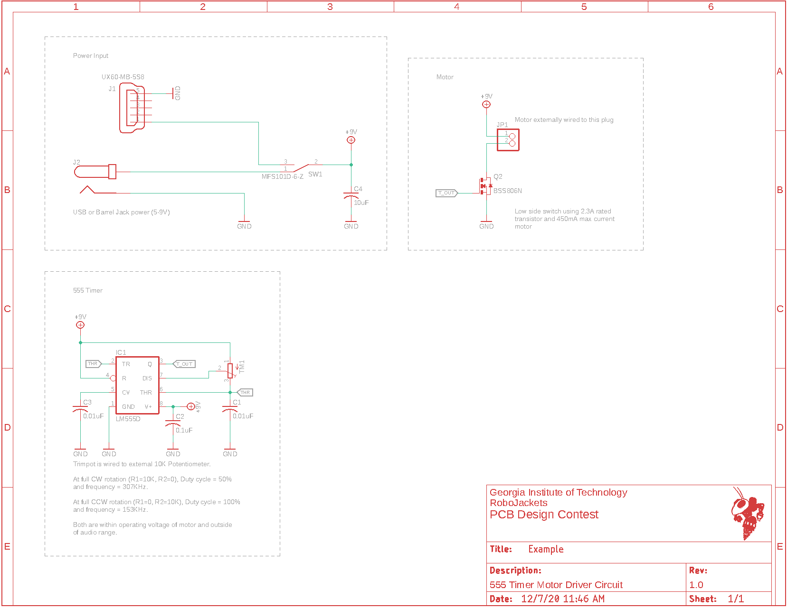

# 555 Timer Motor Driver

## Overview

This is a simple board to spin an external motor using a 555 timer while being  cheap ($19.94 per the [BOM](BOM.csv)). The board is designed to be manufactured using **JLCPCB** and is a regular 2 layer board with black soldermask and an ENIG finish for aesthetics.

## Power Input

It features input power switching between 5V USB and 9V barrel jack input using the main power switch.

## 555 Timer

The direction and rotation speed are controlled using a externally wired trimpot. The rotation frequency and duty cycle for the max and min posistion of the trimpot were calculated.

## Motor

The motor is low side switched using a standard N-Channel MOSFET.

## Firmware

This board does not have any programmable components so no firmware is required.

## Images

Schematic:

Board:

3D Render:

