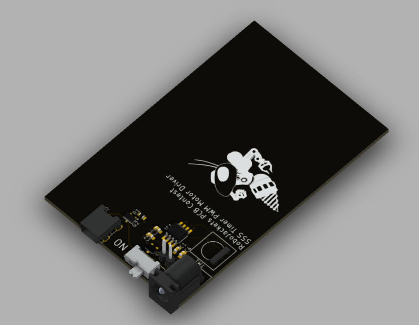

# 555 Timer Motor Driver Circuit

## Overview

This is a simple board to spin an external motor using a 555 timer while being relatively cheap. The board is designed to be manufacutred using *JLCPCB* and is a 2 layer board.

## Power Input

It features automatic input power switching between 5V USB and 9V barrel jack input. The power is switched between inputs using a P-Channel MOSFET prior to the main power switch.

## 555 Timer

The direction and rotation speed are controlled using a externally wired trimpot. The rotation frequency and duty cycle for the max and min posistion of the trimpot were calculated.

## Motor

The motor is low side switched using a standard N-Channel MOSFET.

## Images

Schematic:

Board:

3D Render:

