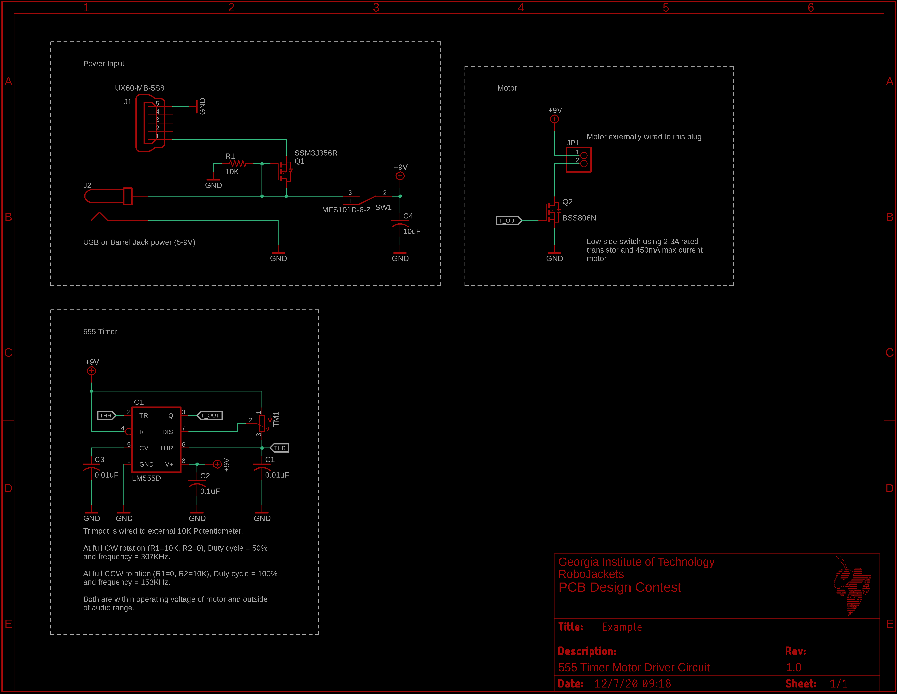

This is a simple board to spin an external motor using a 555 timer. It features automatic power switching between 5V USB and 9V barrel jack input. The direction and rotation speed are controlled using a externally wired trimpot.

Schematic:

Board:

3D Render:

